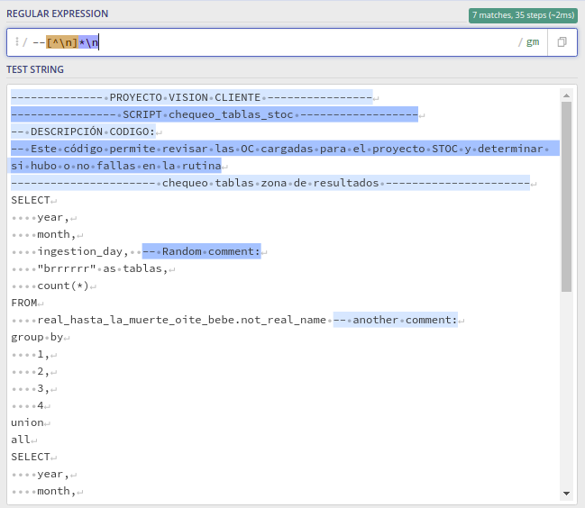

# sql_queries_analizer

python code created to find bad practices (a list of bad practices defined by the organization where I was working at that moment) in the sql quries.

## The context
There was a limited amount of servers for every big data job in the company, so in order to give all of the users the best possible experience every sql script to be executed in the
clusters must compliance with a group of rules established by the company.

## The rules

1. every query must specify the partition where the desired data is stored

2. every query must specify the desired columns

3. every query must use 7 joins at most

4. every query must have maximun 50 cases

5. every case clause mush have at must 20 when clauses

## The problem

There was a lot of really large sql scripts to be analized, this resulted in developers not been able to do other more interesting task that not only bring a great return of investment to the company but also great pride to the developers.

## The solution

Using regular expresions to detect the piece of code where any of these rules was been broken

### The regex to detect the rule # 1

This is the most complex rule and it happen in several phases.

#### phase 0, preprocess strings

The development only care about non-commented lines of codes and non-quoted lines of sql, so first we need to detect the single line comments with this regex.

Then the multine of comments

we proceed with single-quoted parts of the string

and double-quoted  pieces of code

Regex work better when we dont have to worry if the string is lowercase or uppercase if there are newlines, multiple spaces or tabs in the string, so we remove all of this from the string and turn all of the text in lowercase.

#### phase1, phase2 and phase3

In phase #1 (method __fn_find_referenced_tables at the end of subtittle "phase1, phase2 and phase3") we generate a list of every table in the cluster (the rule does not apply on tables created by the user). we check if the name of those tables is present in the query. This is a simple literal match looking for specific names in the string.

Phase #2 check for reference to partitions. References to partitions are sql sentences of the form "where ingestion_year" or  "where year"

Phase #3 create a dictionary of every alias used in the sql query

After these three phases we can check if we have a greater number of base tables (the tables stored in our cluster, not the ones the client create) than partitions referenced, meaning that we have a sql script that should not be executed in the cluster because does not comply the organizations rules

### The regex to detect the rule # 2

Basically what this mean is that no clienct can execute sql sentences of the type "select * from". The regex just need to make a literal match with the asterisk, the challenge here is to determine that the * special character is not been used in a multiplication operation.

When the * special character is been used to indicate the use of every column in a table it appear before or after a comma or before the from clause.

There is another way a developer can use the asterisk to select every column in a table, it would be in queries of the type " table.* ", in this case is pretty easy, we just need to make a literal match with point folllowed by asterisk " .* "

### The regex to detect the rule # 3

Here we just do a literal match with the word join, count the number of ocurrences and there we have it

### The regex to detect the rule # 4

Equal to rule #3

### The regex to detect the rule # 5

The trick here is to use the regex that appear in the image below detect where the case clause start and where it end. Afeter that we just need to count ocurrences of the when clause.

